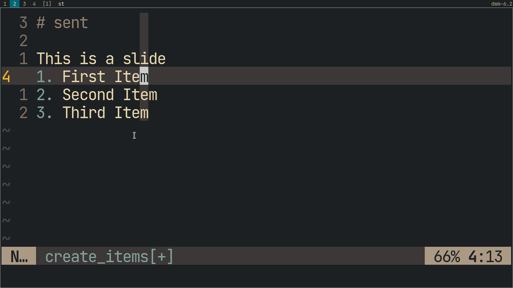
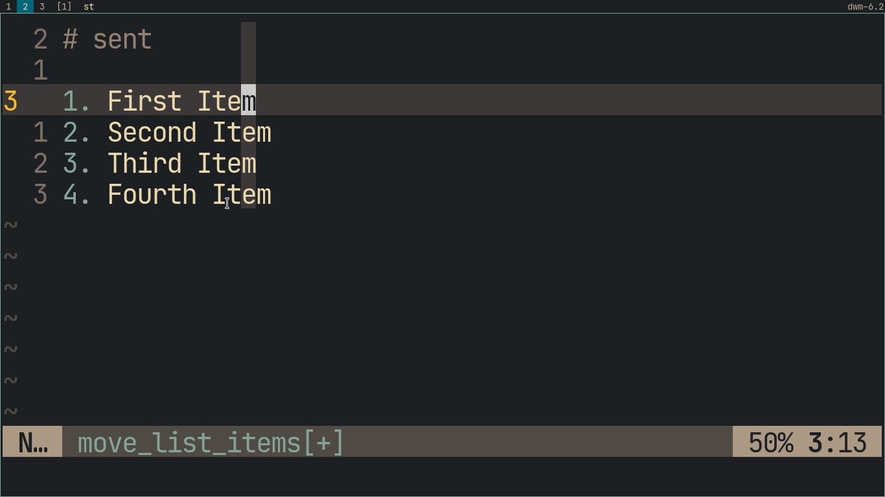
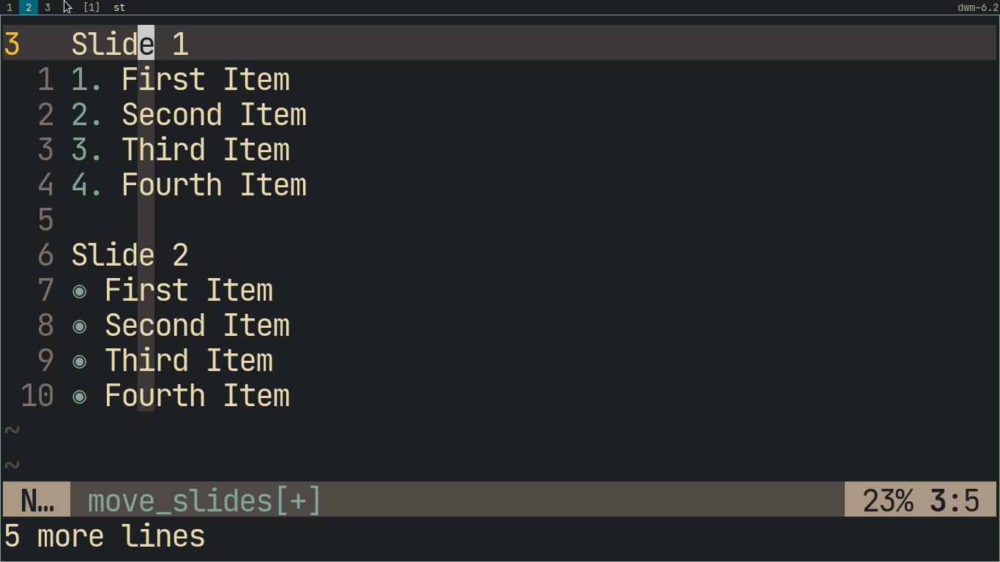
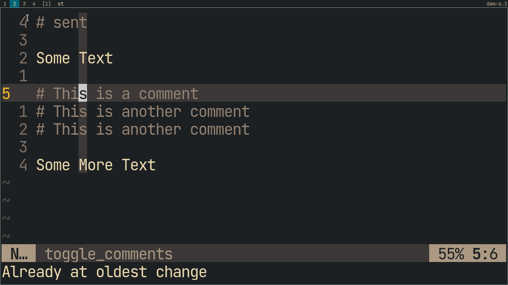
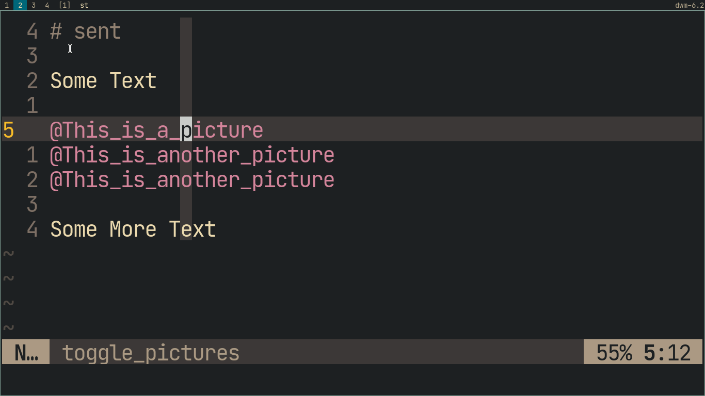
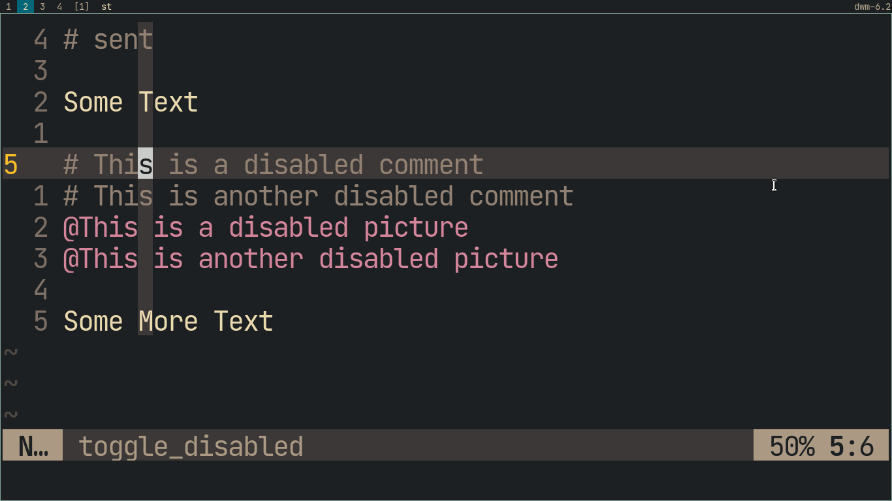
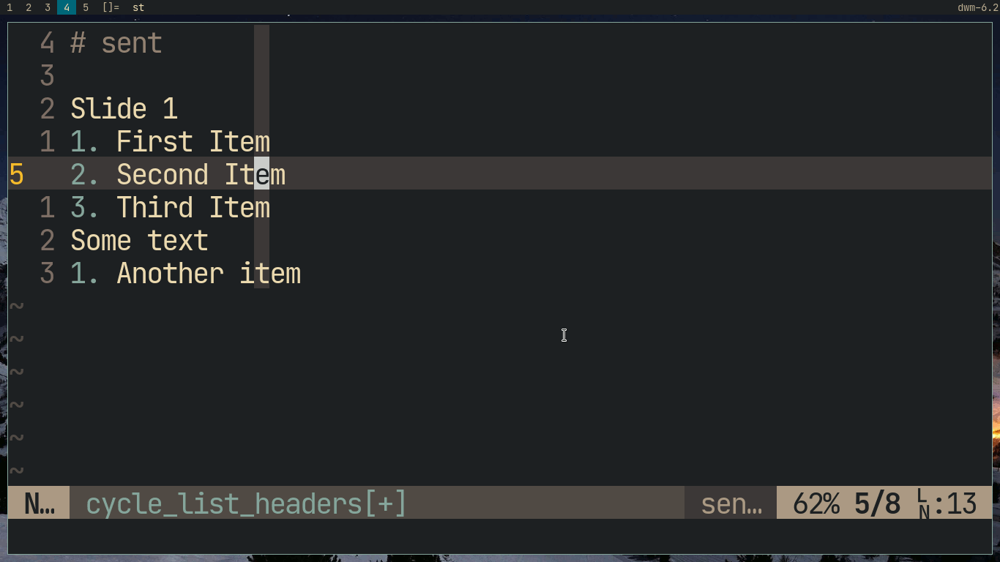

# Vim Sent
[Sent](https://tools.suckless.org/sent) is a Suckless tools used to create very quick presentations in plain text format. This plugin makes it even easier, with lots of key combinations to manipulate lists, slides, images and comments.

# Installation
## Vim
```sh
git clone https://github.com/shoumodip/vim-sent ~/.vim/pack/plugins/start/vim-sent
```

## Neovim
```sh
git clone https://github.com/shoumodip/vim-sent ~/.config/nvim/pack/plugins/start/vim-sent
```

Or you can use any plugin manager of your choice.

# File Detection
- You can name the file as `FILENAME.sent`\.
- You can name the file anything and place `# sent` in the **first line** of the file.

# Features
## Create new list Items
`O` Create new item above current item in *Normal Mode*\
`o` Create new item below current item in *Normal Mode*\
`<Tab>` Create new item below current item in *Insert Mode*



## Move items
`K` Move current item up in *Normal Mode*\
`J` Move current item down in *Normal Mode*\
This will automatically stop working when you reach the boundary of the list (beginning/end of file/paragraph) in *Normal Mode*



## Move Slides/Paragraphs
`<C-K>` Move current Slide/paragraph up in *Normal Mode*\
`<C-J>` Move current Slide/paragraph down in *Normal Mode*\
This will automatically stop working when you reach the boundaries (beginning/end of file) in *Normal Mode*\
Also, if you use `K` or `J` (the *Item Moving* hotkeys) on **normal text** (any **non-list text**), it will move the slide as well.



## Toggle Comments
`gcc` Toggle comment in the current line in *Normal Mode*\
`gcap` Toggle comment in the current Slide/paragraph in *Normal Mode*\
`gc` Toggle comment in a visually selected region in *Visual Mode*



## Toggle Pictures
`gpp` Toggle picture in the current line in *Normal Mode*\
`gpap` Toggle picture in the current Slide/paragraph in *Normal Mode*\
`gp` Toggle picture in a visually selected region in *Visual Mode*



## Toggle Disabled
`gdd` Toggle disabled in the current line in *Normal Mode*\
`gdap` Toggle disabled in the current Slide/paragraph in *Normal Mode*\
`gd` Toggle disabled in a visually selected region in *Visual Mode*



## Cycle List Item Headers
`<Tab>` Cycles through the list headers in *Normal Mode*.\
`<Shift-Tab>` Cycles through the list headers in reverse order in *Normal Mode*.\
This will change the list item headers of all list items in the Slide/paragraph and will only work if the current paragraph has a valid list. Also, *your* list of headers will be **different** from this gif based on your configuration (see below)



## Other Keybindings
`cr` Create blank line after current item in *Normal Mode*\
`<C-a>` Refresh the list numbers in the current paragraph.\
`<F5>` Open preview in sent

# Abbreviations
These abbreviations will work if the characters are used as a single word, i.e. separated by a space/line-beginning/etc on either side. For more info, see `:help abbrev`\
`.` will write `•`\
`->` will write `→`\
`>` will write `‣`\
`*` will write `◉`

# User Configuration
## More bullets
By default, the list of valid bullets include the characters `-`, `‣`, `→`, `•` and `◉`. However you may want to add more bullets.\
Put this in your vimrc/init.vim **before** you source the plugin
```vim
let bulletlist = ['+']
```
This will make the '+' character **also** a valid list bullet and all the awesome syntax-highlighting, automatic-creation, moving-up-and-down features will **also** work for a list item starting with '+'

## Override existing list of bullets
Put this in your vimrc/init.vim **before** you source the plugin
```vim
let newbulletlist = ['+']
```
This will make the '+' character the **only** valid list bullet. All the awesome syntax-highlighting, automatic-creation, moving-up-and-down features will **only** work for a list item starting with '+'

## Copy Register
By default when moving list items/slides, vim-sent uses the `q` register for clipboard management so as to keep the main clipboard untouched. However if this conflicts with a macro you have created or some other plugin, worry not. You can change it.
```vim
let g:userRegister = 'w'
```
Like the other configurations, this should be placed *before* sourcing the plugin. This will change the register vim-sent will use to `w` so that the `q` register remains untouched.

# Inspiration
Org Mode

# License
MIT
